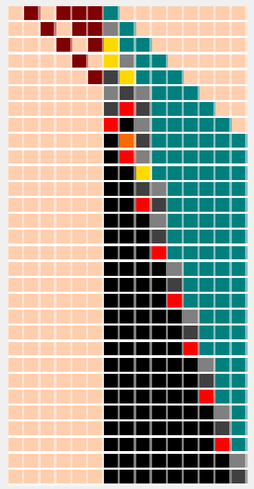
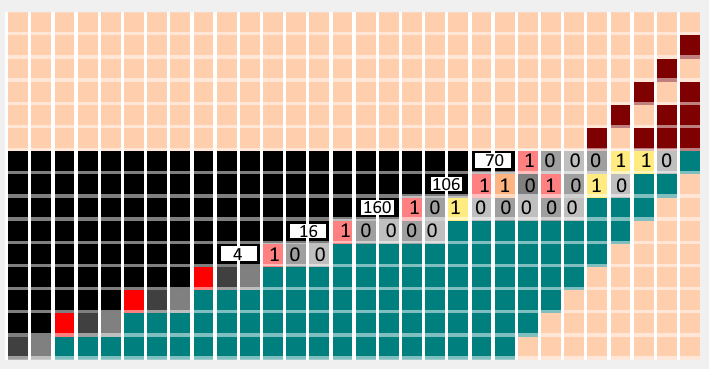
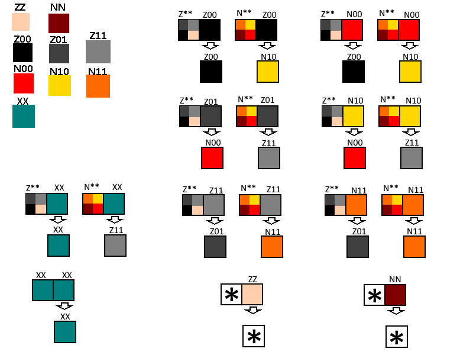

# CollatzAutomata

An elementary cellular automata that goes through a Collatz (or Hailstone) descent.

The 3n+1 problem, also known as the Collatz Congecture or Hailstone problem, involves iterating a number repeatedly using the following rules:
For a given number n,

- if n is odd, the next number will be 3n+1
- if n is even, the next number will be n÷2

This process appears to always result in reaching the number 1.
This cellular automoton simulates these steps.

The cellular automata is an elementary cellular automata. Each row is a single slice in time, with the next time step given in the row below.
This example is done on the number 23.

To initialise the world of cells, we take 23 as binary, which is 10111, and use the iniatlisation cells and the end of number cell (the blue cell) as seen in the first row.

We can determine the sequence of numbers generated by 23 as we apply the Collatz operations.
- 23 is odd, so first we multiply by three and add one. We get 3×23 +1 =70
- 70 is even, so we divide by two and get 70÷2 =35
- then 3×35 +1 =106
- 106÷2 =53
- 3×53 +1 =160
- 160÷2 =80
- 80÷2 =40
- 40÷2 =20
- 20÷2 =10
- 10÷2 =5
- 3 +1 =16
- 16÷2 =8
- 8÷2 =4
- 4÷2 =2
- 2÷2 =1

If we now look back at the example for 23, we can see how it simulates these steps. Turing the picture on its side, we can look at a single cell through time
and see how it represents a one of the numbers in the sequence generated by 23. 

The numbers represented are those generated immediately after a 3n+1 step.
You can read their binary representation by treating the red, orange, and yellow cells as binary 1 and the black and grey cells as binary 0.

The cellular automata consists of 9 cells, 2 initialisation cells (ZZ, NN) , 6 functional cells (Z00,Z01,Z11,N00,N10,N11), and the end of number cell (XX).
The following rules govern the behaviour of the cells. Each cells new state is determined by its current state and the state of the cell to the immediate left.

