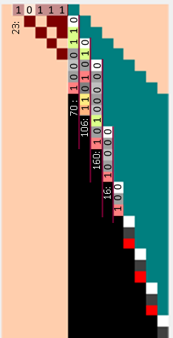
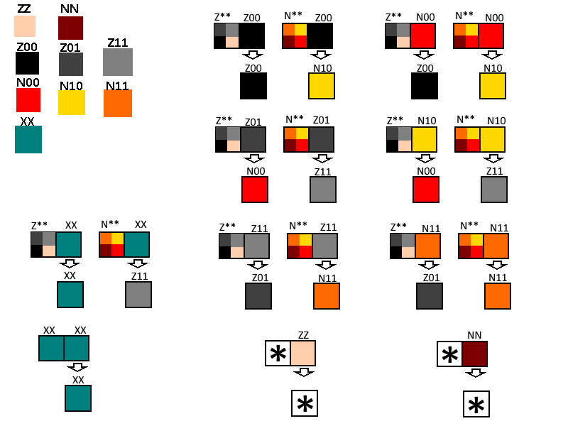

# CollatzAutomata
Note that this document is currenlty incomplete and does not fully describe how the automota works.
An elementary cellular automata that goes through a Collatz (or Hailstone) descent.

The 3n+1 problem, also known as the Collatz Congecture or Hailstone problem, involves iterating a number repeatedly using the following rules:
For a given number n,
if n is odd, the next number will be 3n+1
if n is even, the next number will be n/2

This cellular automoton simulates these steps.

The cellular automata is an elementary cellular automata. Each row is a single slice in time, with the next time step given in the row below.
This example is done on the number 23, first converted into binary to be represented as 10111

The cellular automata consists of 9 cells, 2 initialisation cells (ZZ, NN) , 6 functional cells (Z00,Z01,Z11,N00,N10,N11), and the end of number cell (XX).
The following rules govern the behaviour of the cells. Each cells new state is determined by its current state and the state of the cell to the immediate left.

